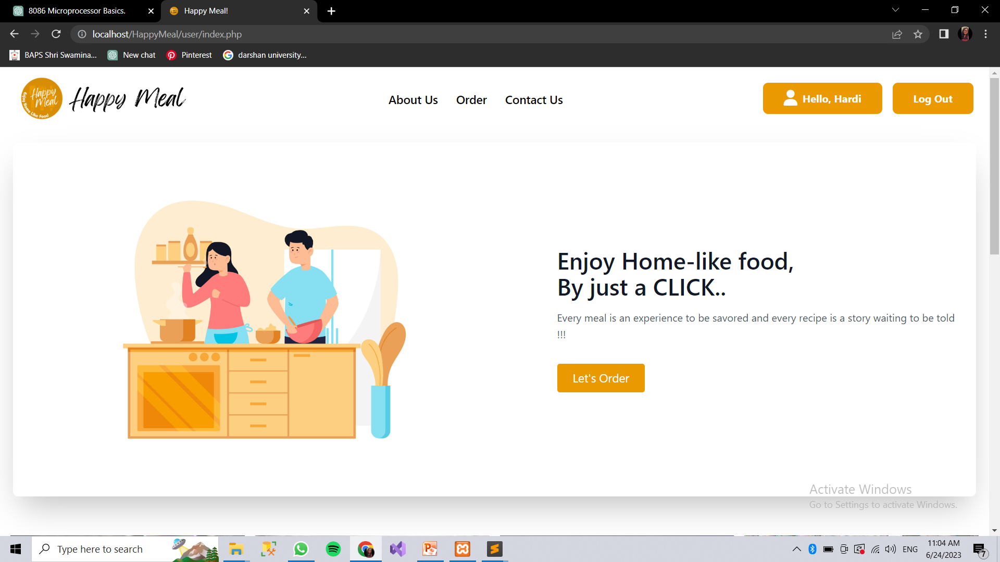

# HappyMeal!!

## Steps to Download
- Download Zip File
- Create a directory

    `mkdir xampp\htdocs\HappyMeal`

- Unzip the file in `HappyMeal` folder
- Start Apache and MySQL server
- In phpmyadmin create a database name `happymeal`
- Run the `DBhappymeal.sql` 
- Open new tab on Chrome and enter URL

    `localhost\HappyMeal`

## Languages Used

1. HTML

2. Tailwind CSS

3. PHP

4. Xampp

5. MYSQL
